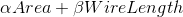

# Floorplan Design for Modern FPGAs
## Outline
* Introduction 
* Algorithm
* Compaction & Postprocessing
* Experimental results

## Why FPGA Floorplaning?
* Floorplaning enbles
	* a divide-and-conquer approach to the physicla implementation
of large designs
	* parallel compilation
* Floorplaning is also a required step in partial
reconfiguration design flow

## FPGA Architecture

## FPGA Floorplaning
* Place a set of modules onto an FPGA chip.
* Resource requirement vector of a module <n_1, n_2, n_3>
	* n_1 is the number of CLBs
	* n_2 is the number of RAMs
	* n_3 is the number of MUXs
* Place eacho module in a rectangular region
satisfying its resource requirement.
* No overlapping among modules.

## Slicing Floorplan

## Module Realizations
* Employ a coordinate system on the chip.
* A realization $r$ for a module $\theta$ is a rectangular
region <x, y, w, h>
	* (x, y) is the coordinate or $r$'s lower left corner.
	* w is the width of $r$.
	* h is the height of $r$.
	* $r$ satisfies the resource requirement of $\theta$.

## Dominace Relation
* $S_\theta$: set of all realization for a module $\theta$
* r_1, r_2 are two realizations from $S_\theta$
	* r_1 dominates r_2 iff
		* x(r_1) >= x(r_2)
		* y(r_1) >= y(r_2)
		* x(r_1) + w(r_1) <= x(r_2) + w(r_2)
		* y(r_1) + h(r_1) <= y(r_2) + h(r_2)

## Irreducible Realizations List (IRL)
* An irreducible realization list for module $\theta$
	* $L_\theta (x, y)$: a list of realizations
		* The starting point of each realization is (x, y).
		* No other realizations starting from (x, y) dominate
an of these realizations.
* Realizations of $L_\theta (x, y)$ are sorted in decreasing 
height.
* IRLs for internal nodes (sub-floorplans)

## Algorithm
* Simulated annealing (SA) searches on slicing floorplans.
* The cost function:

## Reduce Space Complexity
* Each FPGA chip is a 2-D array of a basic pattern.
* We can get $L_\theta (x, y)$ for all (x, y) on a chip by
computing IRLs for every point on the basic pattern only.
* It is practical to impose aspect ratio bounds.
* For performance consideration, we prefer each
module to have aspect ration close to 1.
	* Short internal wire length.

---
---

## Characteristics of FPGA floorplanning
* heterogeneous resouces
* fixed outline 
* fixed distrucution of resouces
* modules can be placed anywhere
and have no fixed shapes but
must satisfy
the resource requirment of each module

## Some basic question
1. How to represent a floorplan?
2. How can we efficiently idnetify rectangular region
fit for a module?
 
