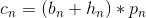

# FPGA Routing

## Outline
* Constraints and objectives
* Routing resource graph
* Global routing and detailed routing
* VPR router
* Timing-driven routing

## Introduction
* FPGA routing must make use of prefabricated
 routing resources.
* #1 objectiveL 100% routing completion.
* Can be performed in two phases (*global routing,
 detailed routing*) or combined.

## Routing FPGA
* Must consider *switch-module architectural
 constraints*.
* For *performance-driven routing*,
	* **Minimize # of switches passed**.
	* Minimize the maxinum wire length.
	* Minimize the maxinum path length.

## Routing-Resource Graph
* A *graph model* for routing
	* Wire/pin -> node
	* unidirectional switch -> a directed edge
	* Bidirectional switch -> two directed edges

## Global Routing
* Find a *routing tree* for each net.
* Select a set of channels, but not specific routing
 tracks.
* Subject to *channel capacity*.

## Coarse Routing Resource Graph
* A graph model for global routing
	* Associate a capacity to a node
	* Capacity of a node = corresponding channel capacity

## Detailed Routing
* Find a track assignment for each net under its given global routing configuration.

## Detailed Routing via SAT
* Formulate a routing instance as a *Boolean
 satisfiability problem* in conjunctive normal form.
* Consider all nets simultaneously, and can prove
 unroutability.
* Connectivity constraints: each net must be
 connected.
* Exclusivity constraints: each track must be used
 by <= 1 net.
* Rely on efficient SAT-solver (SAT is NP-hard).
	* 3-SAT is NP-hard.

## VPR Router
* Combined global and detailed routing.
* Routing algorithm based on PathFinder.
* Use maze expansion to construct routing tree
 from a signal's driver to its loads in the routing
 graph.
* Congestion component is used to gradually
 resolve congestion by encouraging nets to take
 *detours around congested resources*.

## Details of VPR Router
* VPR router is based in PathFinder which is an
 *iterative negotiation-based* routing approach.
* In each iteration, route all nets independently w/ mininum cost
 (nets may share same routing resource).
* Cost of using a resource is based on its *current
 & historical congestion*.
* Cost of resource *n* is  
where *b_n* is the base cost for delay of using *n*,
 *p_n* is #nets presently using *n*,
 *h_n* is historical congestion of *n*( if *n*
 has an overflow, or $H_{n}^{i-1}$ otherwise)

## Negotiated Congestion Routing Flow

## Routing Two0Terminal Nets in VPR
* Use maze expansion to route two-terminal net:
	* Labelling (breadth-first traversal)
	* Connection after labelling
* Use an *incremental* technique for faster multi-
terminal net routing.
	(a) Expansion reaches a sink
	(b) Traditional method: restart wavefront
	(c) VPR method: maintain wavefront
 and expand around new wire
