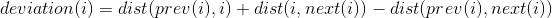
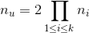

# Timing Optimization Techoniques for FPGAs

## Outline
* Introduction
* Post-Placement Timing Optimization by Logic
Replication
* Post-Routing Timing Optimization by LUT
Output Polarity Selection

## Introduction
* Due to some special architectural characteristics
of FPGA, there are some unique opportunities
for timing optimization not found in ASIC.
* We consider examples of post-placement and post-routing
timing optimization.

## Circuit Delay and Mon-Monotone Paths
* Clock period depends on critical path delay
which is dominated by interconnect delay
* Even with timing-driven placement, typical critical paths are non-monotone
* "Straightening" a non-monotone paht can reduce
its delay, but ...

## Timing Optimization by Lgic Replication
* Moving one cell to straighten one non-monotone path
may degrade other paths
* Solution: Replicate a cell
* We can take advantage of the unused LEs in a FPGA

## Duplication Algorithm
* psudo-code
* Use local monotonicity to guide replication
	* Select critical path cell with high deviation from its
loca monotone region:

* Careful fanout partitioning to avoid degrading
other paths
* Legalization removes cell overlap introduced by
replication

## Experimental Results
* Apply logic replication based timing
optimization after placement
	* Only modest increase ( < 1%) in #LEs used
	* Recude worst path delay by 13% on average
	* Increase total wirelength by ~ 3%

## Delay Characteristics in FPGA
* Significant difference in rise and fall delays in
logic blocks and buffered routing MUXes
	* due to mobility difference in P and N transistors

## Timing Optimization by LUT Output Polarity Selection
* LUT output ploarities impact path delas
* Timing optimization by output polarity selection
after P&R has 0 cost.

## Polarity Selection Algorithm
* Assumptions
	* Circuit already placed & routed
	* Static timing analysis done to obtain a timing graph
* Algorithm
	* *Phase 1: Compute delay tuples*
		* Compute possible rise and fall delays for each node, that
reflect different polarity settings
		* Process nodes in topological order (from PIs to POs)
	* *Phase 2: Output polarity selection*
		* Select polarity of each LUT output to optimize rise and fall
delays at POs

## Phase 1: Compute Delay Tuple Sets
* psudo-code
* # tuples formed at node *u*
	* , where *n_i* = # tuples in *i*-th fanin of *u*
	* Grow exponentially!
