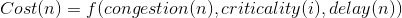

# Power Optimization Techniques for FPGAs

## Outline
* Introduction
* Hardware Techniques
* EDA Solutions
* Hardware + EDA

## Introduction
* Power consumption is a key concern today
* Reducing power will 
	* Lower packaging cost and cooling costs
	* Improve reliability
	* Lengthen the battery life of mobile device
* FPGA's programmability incurs extra power overhead in
	* More transistors are needed to omplement a logic
function than custom ASIC
	* Longer wire lengths
	* Inclusion of programmable routing switches

## Power Reduction Techniques
* Combination of techniques to reduce
	* Dynamic power
	* Static power
* Combination of hardware techniques and EDA
solutions.

## Dynamic Power vs Leakage Power
* Two major sources of power dissipation
	* Dynamic power -- caused by signal transition
	* Static (leakage) power -- caused by leakage currents
in off transistors
* Dynamic power: 
* Leakage power
	* proportional to transistor count
	* dependent on supply voltage and threshold voltage

## Selectable Core Voltage
* Selectable core voltage allowas user to choose
lower core voltage if performance can be met
* Dynamic power: 
* Lower supply voltage reduces
	* dynamic power (quadratically)
	* Leakage power (more than quadratically)

## Programmable Power Technology in FPGA
* Only a small percentage of logic is timing-critical
* Recude leakage power by running non-timing critical
logic on low-power mode

## Dynamic Power Optimization in LUT with Unused Input(s)
* A mapped design has many LUTs with unused input(s)
* How to optimize dynamic power consumption of such LUTs?

## Leakage Power in FPGA
* Many MUXes and buffers in FPGA, they
consume leakage power

## Buffer Leakage Characteristic
* Buffer leakage power is smaller when input = 1
	* due to different leakage characteristics of N and P
transistors and transistor sizing for delay

## MUX Leakage Characteristic
* MUX leakage power is smaller when output = 1

## Leakage Power Optimization by LUT Output Polarity Selection
* Want signals to spend most of their time in logic 1 state
* Signals spending more time in logic 0 state are
candidates for inversion
* Most signal can be inverted below:

## Poalrity Selection Algorithm for Leakage Power Optimization
```
function OptimizeLeakage(design, signal static probabilities)
	for each signal n in the design do
		if static_probability(n) < 0.5 then
			if signal n can be inverted then
				invert(n)
				// FPGA is re-programmed; n replaced with ~n
	return new design
```

## Exprimental Results
* Leakage power reduction by polarity selection

## Leakage Characteristic of MUX Transistor Pair
* Leakage of transistor pari in a MUX depends on
values of input pari
	(a) shows low-leakage multiplexer configurations
	(b) shows high-leakage multiplexer configurations

## Leakage Power Optimization by LUT Input Vector Reordering
* How to optimize leakage power for LUT with unused input(s)?

## Power-Driven Synthesis

## Power-aware Placement
* Use cost function including estimated dynamic power:

* Dynamic power consumption of a signal esitmated
based on this switching activity, fanouts, X-span and Y-span

## Power-Driven Place & Route
* Minimize capacitance of high-toggling signals
* Without violating timing constraints

## Power-Driven Route
* Timing-critical nets
	* route with minimum delay
* Non-timing-critical nets
	* route with a cost considering capacitance and
switching activites
* In iterative negotiation-based routing
	* hight activity nets are given preference to retain low-
capacitance routing resources

## Reducing Clock Power by Power-aware Placement and Shutdown of Clocks
* Shut down unused clock signals to reduce power
* Gropu logic with common clock into same LAB
in power-driven placement

## Glitch Power
* *Glitches* at gate output are unwanted signal transistions
due to unbalanced arrival times at gate inputs.
* E.g. Input transition from 000 to 111
* For FPGA, glitch power accounts for a significant 
portion of dynamic power (>20%)

## Don't Cares in Logic Circuit
* A mapped LUT nay have *don't care* entries
* Don't care entry: an input pattern can never occur
or output cannot propagate to POs

## Glitch Reduction by Don't Care Assignment
* Glich reduction by proper logic value assignment for
don't cares (use a simple majority vote heuristic)

## Interconnect Power Consumption
* Routing power is prime component of FPGA dynamic power
* Large wire capacitance results in high power
consumption.

## Unused Wires in FPGA
* FPGAs typically have underutilized wires
* Can we take advantage of unused wires?

## Wire Capacitance
* Wire capacitance consists of:
	* Coupling capacitance (C~C~) -- between adjacent wries on same layer
	* Plate capacitance (C~P~) -- between adjacent wires on 
different layers
* Due to aspect ratio of wires C~C is dominant

## Wire Capacitance Optimization in ASICs
* In ASICs, have freedom to optimize wire width and spacing
	* Can optimize *w_i* and *s_i* to maximize timing, minimize power
	* Optimize *w_i* and *s_i* subject to $\sigma w_i + \sigma s_i = W$
* if net *j* is timing/power critical:
	* Can increase *s_2* and *s_3* to reduce C_C
	* Reduces capacitance on net *j*, improves speed and
reduces power
* Can also optimize w_1, w_2, w_3 for speed and power

## In FPGAs?
* FPGA wiring prefabricated, width and spacing fixed
* Can't space wires used wires apart, unused wires in the way
* Capacitance on wires in two routing options the same
	* Despite the fact that nets *i, j, k* are now spaced further apart

## Wire Cap. Optimization (1)
* What's the total impedance seen by Routing Conductor 1, looking towards Routing
Conductor 2?

## Wire Cap. Optimization (2)
* If R_eq is small, capacitor C_C2 + C_P is shorted out
* Impedance looking towards Routing Conductor 2
is the capacitor C_C

## Wire Cap. Optimization (3)
* If R_eq is large, we approximate as an open circuit
* Z_IN equal to series combination of C_C and C_C2 + C_P
* Series combinations of capacitors result in reduced capacitance:
	* If C_1 in series with C_2, eq. capacitance C_eq = C_1C_2/(C_1+C_2) < C_1
* So, we can reduce capacitance if R_eq is large enough
* Making R_eq large is bad...
	* buffer delay ~ R_eqC_wire --> increase in R_eq increases delay
* What if we made R_eq large only for unused conductors?
	* Would not result in increased delay of used conductors
	* Neighbouring used conductors would see beefit of reduced cap.
* Need to be able to set R_eq large for unused conductors, but
small for used conductors
	* Use tri-state buffers!

## Optimize Wire Cap. by TSB (tir-state buffer) and Routing
* I fintermediate wires are tri-stated, see reduced C_C !!
* In this work we tri-state unused wires to reduce wire cap.
	* Proposed a novel, lightweight TSB topology
	* Proposed CAD techniques to space wires out, reduce effective cap.

## Traditional Tri-state Buffers
* Header transistor M5 cuts off pull up path to output
* Unused buffer would have IN at VDD
	* M_1 pulls gate of M_6 to GND
* Large area cost: M_2, M_4, and M_5 must be big due to stacking

## Proposed Tri-state Buffer
* dratiscally reduce area!

## Proposed CAD Flow
* Power and speed of a conductor can be optimized if adjacent
conductor(s) unused
* For capacitance reduction we need CAD which ensures
conductors adjacent to power/timing critical nets are unused

## Modifications to VPR Router
* VPR router cost function for expanding net *i* to node *n*:
	* 
	* if *i* is timing critical focus on using fastest resources
	* if *i* is not timing critical use uncongested resources
* Tomaximize capacitance reduction:
	* Want to route high activity nets with usused adj. conductors
	* Want to avoid using routing conductors adj. to high activity nets

## Results
* Dynamic power reduction exceed 15% for C_C/C_P ~= 3
* Get additional 14.6% leakage power saving from TSB
* Critical path degradation ~1%
* Total area overhead ~2.1%

---
---

## PPA optimization
* power, performance, area
