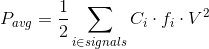
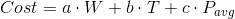

# Power Optimization Techniques for FPGAs

## Outline
* Introduction
* Hardware Techniques
* EDA Solutions
* Hardware + EDA

## Introduction
* Power consumption is a key concern today
* Reducing power will 
	* Lower packaging cost and cooling costs
	* Improve reliability
	* Lengthen the battery life of mobile device
* FPGA's programmability incurs extra power overhead in
	* More transistors are needed to omplement a logic
function than custom ASIC
	* Longer wire lengths
	* Inclusion of programmable routing switches

## Power Reduction Techniques
* Combination of techniques to reduce
	* Dynamic power
	* Static power
* Combination of hardware techniques and EDA
solutions.

## Dynamic Power vs Leakage Power
* Two major sources of power dissipation
	* Dynamic power -- caused by signal transition
	* Static (leakage) power -- caused by leakage currents
in off transistors
* Dynamic power: 
* Leakage power
	* proportional to transistor count
	* dependent on supply voltage and threshold voltage

## Selectable Core Voltage
* Selectable core voltage allowas user to choose
lower core voltage if performance can be met
* Dynamic power: 
* Lower supply voltage reduces
	* dynamic power (quadratically)
	* Leakage power (more than quadratically)

## Programmable Power Technology in FPGA
* Only a small percentage of logic is timing-critical
* Recude leakage power by running non-timing critical
logic on low-power mode

## Dynamic Power Optimization in LUT with Unused Input(s)
* A mapped design has many LUTs with unused input(s)
* How to optimize dynamic power consumption of such LUTs?

## Leakage Power in FPGA
* Many MUXes and buffers in FPGA, they
consume leakage power

## Buffer Leakage Characteristic
* Buffer leakage power is smaller when input = 1
	* due to different leakage characteristics of N and P
transistors and transistor sizing for delay

## MUX Leakage Characteristic
* MUX leakage power is smaller when output = 1

## Leakage Power Optimization by LUT Output Polarity Selection
* Want signals to spend most of their time in logic 1 state
* Signals spending more time in logic 0 state are
candidates for inversion
* Most signal can be inverted below:

## Poalrity Selection Algorithm for Leakage Power Optimization
```
function OptimizeLeakage(design, signal static probabilities)
	for each signal n in the design do
		if static_probability(n) < 0.5 then
			if signal n can be inverted then
				invert(n)
				// FPGA is re-programmed; n replaced with ~n
	return new design
```

## Exprimental Results
* Leakage power reduction by polarity selection

## Leakage Characteristic of MUX Transistor Pair
* Leakage of transistor pari in a MUX depends on
values of input pari
	(a) shows low-leakage multiplexer configurations
	(b) shows high-leakage multiplexer configurations

## Leakage Power Optimization by LUT Input Vector Reordering
* How to optimize leakage power for LUT with unused input(s)?

## Power-Driven Synthesis

## Power-aware Placement
* Use cost function including estimated dynamic power:

* Dynamic power consumption of a signal esitmated
based on this switching activity, fanouts, X-span and Y-span

## Power-Driven Place & Route
* Minimize capacitance of high-toggling signals
* Without violating timing constraints

## Power-Driven Route
* Timing-critical nets
	* route with minimum delay
* Non-timing-critical nets
	* route with a cost considering capacitance and
switching activites
* In iterative negotiation-based routing
	* hight activity nets are given preference to retain low-
capacitance routing resources

## Reducing Clock Power by Power-aware Placement and Shutdown of Clocks
* Shut down unused clock signals to reduce power
* Gropu logic with common clock into same LAB
in power-driven placement

## Glitch Power
* *Glitches* at gate output are unwanted signal transistions
due to unbalanced arrival times at gate inputs.
* E.g. Input transition from 000 to 111
* For FPGA, glitch power accounts for a significant 
portion of dynamic power (>20%)

## Don't Cares in Logic Circuit
* A mapped LUT nay have *don't care* entries
* Don't care entry: an input pattern can never occur
or output cannot propagate to POs

## Glitch Reduction by Don't Care Assignment
* Glich reduction by proper logic value assignment for
don't cares (use a simple majority vote heuristic)

## Interconnect Power Consumption
* Routing power is prime component of FPGA dynamic power
* Large wire capacitance results in high power
consumption.

---
---

## PPA optimization
* power, performance, area
