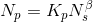

# Circuit Design and Architecture Exploration of FPGAs

## Routing Architecture

## Some Parameters of Routing Architecture
* Input connection block flexibility F~c,in~
	* Fraction of wire segments in a channel connected to an input pin of a block
* Output connection block flexibility F~c,out~
	* Fraction of wire segments in a channel connected to an output pin of a block
* Switch block flexibility F~s~
	* No. of possible connections a wire segments can make to other wire segments
* routing requirmenet vector

## 2 Types of Routing Switches
* Typically, mix pass transistor switches & tri-state buffer switches

## Pass Transistor Routing Switch
* Small area
* Resistive switches
* Faster for short paths
* Delay grows as the suuare of no. of switches

## Tri-state Buffer Routing Switch
* Larger area
* Regenerative driver
* Faster for long paths passing through many switches
* Delay grows linearly as no. of switches

## Other Routing Architecture Factors and Parameters
* Speed, Area and Power also depend on
	* Channel segmentation
	* Transistor size
	* Buffer size
	* Ratio of pass transistor switches & tri-state buffer switches
	* Metal width
	* Wire spacing
	* ...

## Connectivity
* What is the # hops required to get from one logic block to another?
* Fewer hops -> better performance
* More predictable pattern -> easier CAD tool optimization

## Clock Nets
* Must drive all LEs.

## Clock Drivers
* Clock driver tree
* Determine optimal buffer sizes.

## Track Distribution
* Is wiring concentrated near the center of the FPGA?
	* No.
* Is wiring directional (horizontal/vertical) ?
	* No.
* Make channels to I/O pins about 25% larger improves routability.

## Pinout 
* How many pins?
	* Limited by technology.
	* Too much logic, not enough pins means we can't get signals off-chip.
	* Too many pins means logic won't be fully utilized.

## Rent's Rule
* Developed by E. F. Rent (IBM( in 1960.
* Number of Pins vs. number of components is aline ona log-log plot:
	* 
* Parameters may very based on technology:
	* Rent measured $$\beta = 0.6, K_p = 2.5$$
	* Modern microprocessor has $$\beta = 0.455, K_p = 0.82$$

## FPGAs and Pins
* Chop capacity is growing faster than package pinout.
* Harder to user logic ina multi-FPGA design
	* must try to fit a large function with a small interface into the FPGA
	* may use time-division multiplexing for I/Os.

---
---

# FPGA Design Flow

## Outline
* overall Flow
* logic Synthesis
* Mapping
* Place & Route
* Simulation
* Configuration
* Board-level consideration

## FPGA Design Process (1)

## FPGA Design Process (2)

## Logic Synthesis

## Features of Synthesis Tools
* Interpret RTL code
* Procude synthesized circuit netlist in a standard EDIF format
* Give preliminary performance esitimates
* Some can display circuit schematics corresponding to EDIF netlist

## Mapping

## Sample mapping report

## Routing

## Placement

## Sample place & route report

## Functional Simuation
* To verifythe functionality of a design
* The user specifies valuations of the circuit's nputs and examines the output of simulation to verify that the circuit operates a s expected.
* Functional simulator igores the ogic and interconnect delay.

## Post-Layout Timing Simulation
* After the physical design tasks are completed, timing simulation is performed to verify the circuit meets the required performance.
* Information from placement & routing can be *back annotated* to schematic with information on loading and wire delay.
* Timimg simulation simulates the actual propagation delays.

## Configuration
* Once a design is implemented, you must create a file that the FPGA can usderstand
	* THis file is called a bit stream: a BIT file (.bit extension)
* The BIT file can be downloaded directly to the FPGA, or can be converted into a PROM file which stores the programming information.
