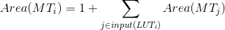
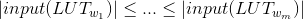
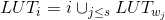
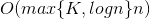

# Technology Mapping

## Outline
* Logic Synthesis 
* Basics of Technology Mapping
* DP Tree-map algorithm
* Greedy Tree-map algorithm
* FlowMap algorithm
* DAOmap algorithm
* WireMap algorithm

## HDL Synthesis
* Synthesis = Domain Translation + Optimization

## Syntax-directed Translation
* Translate HDL into logic directly.
* Generally requires *optimization*.

## Macros
* Pre-designed components
	* Generally identified by languate features.
	* E.g. **+** operator, xxx()
* *Hard macro*: includes placement.
* *Soft macro*: no placement.

## Logic Synthesis Phases
* *Logic optimization* transforms current gate-level network into an optimized gate-level network.
* *Technology mapping* transform the gate-level network into a network of cells in the target technology library.

## Logic Optimization
* Work on Boolean expression equivalent.
* Estimate size based on literal count.
* Estimate delay by simple delay models.
* Use *factorization, substitution, decomposition, extraction*, etc. to optimize logic.

## Technology Mapping
* Map Boolean expressions into a particular *cell library*.
* Mapping takes into account area, delay, etc.
* May perform some optimizations in addition to mapping e.g. retiming.
	* repositioning the FFs for improving the performance or
reduce the circuit size w/o changing the functionality
* Allow more accurate delay models.
* GOAL
	* Cover function with library cells
	* To optimize area, delay, etc.

## LUT-based Technology Mapping
* \# Inputs *doesn't* always increase with added function.
* Useful to find the largest cone that will fit into a LUT.

## FPGAs vs. Coustom Logic
* Area cost metric for static gates is literal:
	* ax + bx' has four literals, requires 8 transistors.
* Area cost metric for FPGAs is logic element:
	* All functions that fit in an LE have the same cost.

## Logic Optimization & Technology Mapping

## Technology Mappers for LUT-based FPGAs
* Input can be a sequential circuit.
* Most algorithms work on the combinational portions which are *directed acyclic graphs (DAGs)*.
* for mapping with *K*-input LUTs
	* Remove sequential elements to break into combinational portions.
	* Covering *K*-bounded DAGs by *K*-feasible cones
* Property: a *K*-LUT can implement any function of <= *K* inputs.

## Technology Mapper Classification
* Classification based on objectives:
	* *Area* minimization
	* *Delay* minimization
	* *Power* minimization
	* *Routability* optimization
* Some algorithms perform duplication-free mapping, others allow *duplication* (i.e., a node may be covered by more than one LUT).
* Duplication can lead to reduce no. of LUTs and/or delay.

## Node Duplication

## Hardness of Area/Power/Delay Minimization
* Area-optimal mapping problem (node duplication allowed) is **NP-hard**.
* Power-optimal mapping problem is **NP-hard**.
* But duplication-free area-optimal mapping is **polynomial time solvable**.
* Delay-optimal mapping problem is **polynomial time solvable**.

## DP Tree-ap: duplication-free area-optimal mapping for tree
* Cover a *K*-bounded tree with minimum no. of *K*-LUTs.
* Optimal *dynamic programming* approach.
* Process nodes in *topological order* starting from PIs.
	* PI: primary inputs
* Recursive assumption: When computing the best mapping of tree *T_i*, the best mapping of
all its subtrees are known.
* Enumerate all *K-feasible cones* rooted at node *i*.
* If mapping *MT_i* uses a LUT_*i* to implement node *i*:
	* 
* A best mapping *MT^\*_i* is one such that Area is minimum.

## DP Tree-map

## Greedy Tree-map: duplication-free area(delay)-optimal mapping for tree
* An optimal greedy algorithm without enumeration for min-area tree mapping.
* Let *w_1, ..., w_m* be the fanin nodes of node *i* and 
 .
* Greedy packing:
	* Cover *i* by  where *s* is the
largest index s.t. LUT_*i* remains *K*-feasible
* Time complexity is .
* Modification for depth-optimal tree mapping:
	* Order the fanin nodes of node *i* by their LUTs' depths in decreasing order.

## Greedy Tree-map

## Heuristic for General Network Mapping
* Partition a network into trees
	* Cut the network at all multiple fanout points
* Optimally cover each tree
* Piece the tree-covers into a cover for the subject graph
