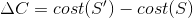
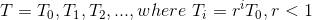

# FPGA Placement

## Outline
* Constraints and objectives
* Placement approaches
	* Simulated annealing-based
	* Partitioning-based
	* Analytical method
* Representative placers
	* VPR placer (SA-based)
	* PPFF (partitioning-based)
	* RAAAP (analytical)

## FPGA CAD Flow

## FPGA Placement
* Goal: Place each logic block of a netlist to a unique and legal position on an FPGA

## Placement Objectives
* Minimize the required wiring
	* *wirelength-driven* placement
* Balance the wiring density across the FPGA
	* *routability-driven* placement
* Maximize circuit speed
	* *timing-driven* placement

## FPGA-specific Placement Issues
* Has to deal with *fixed acrrier dimensions*.
* *Channel density* in every channel cannot exceed
the number of routing tracks available.
	* How to estimate the channel density?
* FPGA contains routing tracks of various lengths.
	* How to estimate interconnection delay?
* Simple interconnection *delay estimation* model
based on net length or fanout are not accurate for FPGA.

## On Delay Estimation
* *Which is the best route from home to the office?*
	* Longer, but faster
	* Shorter, but slower

## Close Relation with Routing
* Ideally, placement and routing (P & R) should be performed simultaneously as they depend on each other's results.
* In pratice, placement is done prior to routing as simultaneous placement and routing is to complicated.

## Placement Approaches
* 3 major classes of placers:
	* *Simulated annealing* based placers
	* *Min-cut (partitioning-based)* placers
	* *Analytic* placers

## Simulated Annealing
* Kirkpatrick, Gelatt, and Vecchi,
"Optimization by simulated annealing", *Science*, May 1983.
* local optimum problem
	* This method will avoid getting stuck at local mininum, though.

## Simulated Annealing Basics
* Simulated annealing (SA) is a (stochastic search technique* to search for a near optimal solution
for an optimization problem.
* SA mimics the annealing process used to gradually cool molten metal to produce a high-quality crystal structure.
* SA takes an existing solution and then makes
successive changes in a series of random moves.
* Each move is accepted or rejected based on an
*energy function*.
* Non-zero probability for *"up-hill moves*.
* Probability depends on
	1. magnitude of the "up-hill" movement
	2. temperature
* 
* *T*: Control parameter (*temperature*)
* Annealing schedule:
	*  
