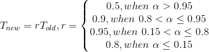
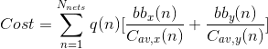
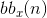
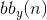
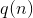
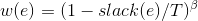
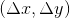

# Constructive algorithm
directly construct an optimal (or nearly optimal) solution
# V.S.
# Search-based heuristic
start with some feasible solutions, then move to better solutions by local moves

---
---

# Greedy search
1. Start with some initial feasible solution.
2. Compute the costs of all neighboring solutions of the current solution.
3. If the best neighboring solution is worse than the current solution stop.
Otherwise, update the current solution and goto 2.

# Drawback of Greedy search
* will get trapped ot local minimum
* Simulated annealing will aviod getting stuck at a local minimum solution

---
---

# Two main strategies for Timing-driven placement/routing
1. path-based approach minimize the worst delay from any Pi to PO
2. net-based approach 
	* minimize a weighted sum of net delay

---
---

## Generic Simulated Annealing Algorithm

## Basic Ingredients for Simulated Annealing
* Analogy
* Basic Ingredients for Simulated Annealing:
	* Solution space
	* Neighborhood structure
	* Cost function
	* Annealing schedule

## Simulated Annealing Based Placement
* A good flow graph, **READ IT CAREFULLY!!**
* Get initial placement by assigning logic blocks
of the circuit randomly to the available locations in the FPGA.
* Cost function
	* For wirelength-driven placement, a common cost function
is the sum over all nets of the *half-perimeter* of their *bounding boxes*.
* Move types
	* Exchange locations of two randomly selected logic blocks.
	* Move a logic block to an empty location

## VPR Placer (SA-based)
* VPR: versatile place and route
* A *siulated annealing-based* placer.
* *Modified temperature updating scheme*
	* Accelerated temperature decrease when move acceptance rate $\alpha$
is very high of low
	* 
* Fast *incremental net bounding box updating*.

## VPR Placer
* Gradually reduce the scope of cell moves or exchanges (long range to short range) to *kepp the
move acceptance rate* close to 0.44.
* *Congestion model* for non-uniform channel capacity (penalize solutions requiring more routing in the narrower channels).
* Cost function of basic mode:

	* : horizontal span of net n
	* : veritcal span of net n
	* : *adjustment factor* depending on #terminals of net n

## Timing-Driven VPR Placer
* Add a timing cost to the objective function
* Timing cost is the *weighted delays* of all
connections (the weight reflects a connection's *criticality*)
	*  where ***T*** is the current
longest path delay, $\beta$ is a constant
	* *Self-normalization*: changes of timing cost and wirelength of a move are normalized by their
previous values
* Use pre-computed *delay lookup matrix* -- delay for 
* Run *static timing analysis* periodically to update
slacks and hence criticalities

## Partitioning-based Placement
* The netlist is repeatedly partitioned into two sub-circuits.
* Meanwhile, the chip area is *partitioned* into two
sub-regions *recursively*.
* Each sub-circuit is assigned to a sub-region.
* The process is repeated until each sub-circuit
consists of a single logic block and has a unique location on the chip area.
* During partitioning, *minimize # cut nets* based on
the intuition that densely connected sub-circuits
should be placed closely.
