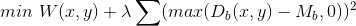

## Some notes
* You can combine SA and Partitioning together.
* SA-based placement start with some initial feasible
placement solution, then improve it gradually using SA.
* Partitioning-based placement directly construct a good placement solution
using the divide-and-conquer strategy.

---
---

## PPFF Placer (partitioning-based)
* ***Top-down partitioning-based placement***
	* Fast (D&C)
* Delay estimation
	* Empirical routing delay analysis
	* Correlate net criticality and routing resource usage
* Delay optimization
	* Align criticality connections
	* Dynamically update net delays

## Net Terminal Alignment in PPFF

## Partitioning Order in PPFF
* Top-to-bottom and left-to-right.
* Alignment dependence "propagates"
* Also proposed a more sophisticated method to determine a good partitioning order.

## Alignment Details
* Higher priority for timing criticality node to align with
its anchor in the direction of a cut.

## Delay Estimation
* Wire length/bounding box **NOT** accurate
	* Same BBox, fewer segs -> smaller delay (e.g. A vs B)

## PPFF Delay Estimation
* Delay estimation
	* *Correlate delay with distance and criticality*
	* Pre-computed table based on empirical data by a router on a 
large no. of circuits.

## PPFF Summary
* Initial analysis
* Recursive bipartitioning
* Refinement

## Analytical Placement
* Used in Xilinx's placer
* Represent placement objective and constraints as 
analytical functions of *x_i* and *y_i*
* Constraints are modified iteratively to move logic blocks away from highly congested regions
* After a legal placement is found, 
result is further optimized by local swap

## Heterogeneous FPGA
* Traditionally, FPGA consists of CLB, IO, and
programmable routing arch
* Nowadays main FPGA components:
* Configurable logic block (CLB)
* Input/output block (IOB)
* Programmable routing architecture
* Random access memory (RAM)
* Digital signal processing (DSP)

## Heterogeneous FPGA Placement
* Place each block of a netlist to a unique and legal position on an FPGA

## Analytical Placement Formulation
* Given the chip region and block dimensions, determine (x, y) for all movable blocks.
* Relax the constraints into the object function (penalty)

## Differentiable Wirelength Model
* Log-sum-exp wirelength model
 
	* Is an effecitve differentiable function for HPWL
approximation and approaches exact HPWL when $\gamma -> 0$

## Differentiable Density Model
* Bell-shaped density model

## Mismatch between GP and Legalization Results
* Global placement -> Continuous solutions
* Legalization -> Discrete and scattered legal locations
* Issue: DSP/RAM blocks get large displacemment from their global placement positions

## Separate Density Model
* Setup a density constraint fro each type of resource
* Unconstrained formulation after "smoothing" and
constraint relaxation with quadratic penalty method

## Look-Ahead Legalization
* Give a quick forecast of legalized placement
* RAMs and DSPs
* Geneal logic blocks

## overall Flow

## Detailed placement
* Apply windows-based cell matching and cell
swapping
